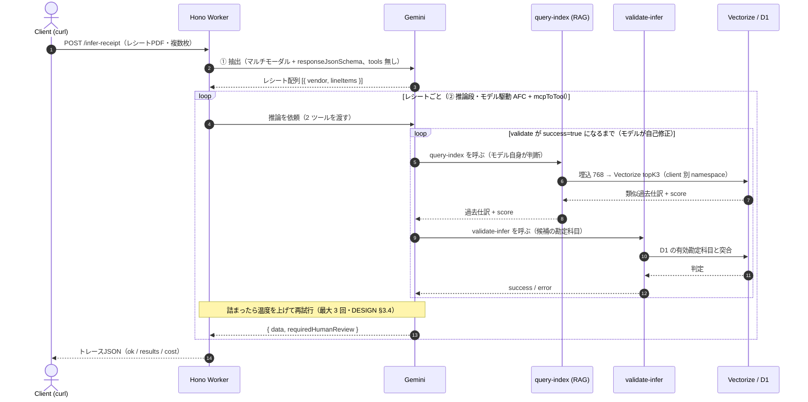
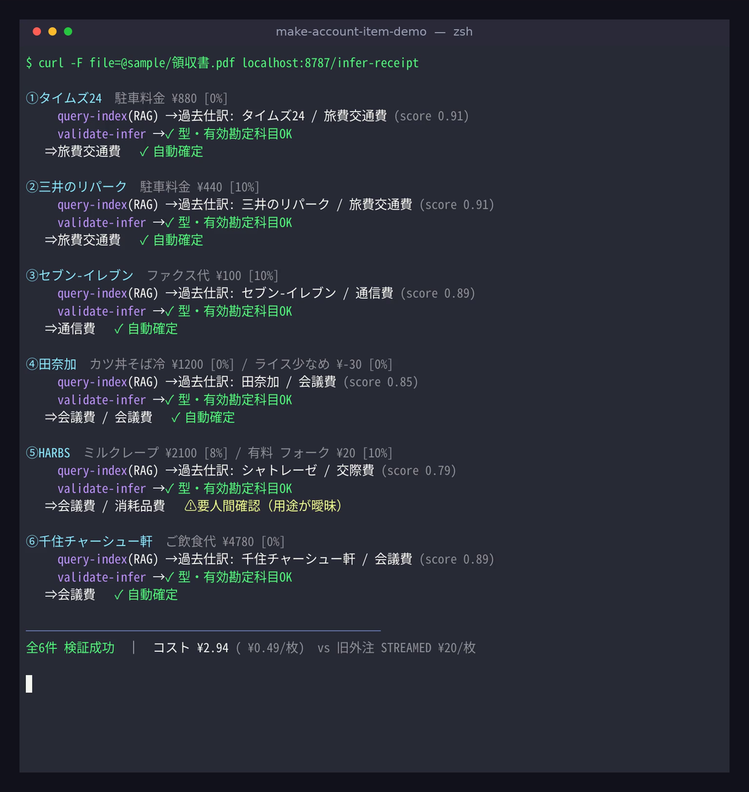

# make-account-item-demo（レシート版）

本番システム `make-account-item`（実在の会計事務所で本番デプロイ・日常使用）の
**レシート経路の agent コア**を、合成データと自分の匿名レシートだけで動く形に抽出したデモ。

設計の意図・本番との差分は **[DESIGN.md](./DESIGN.md)** を参照（各記述に【本番✓】/【デモ】タグ）。

見せるもの：レシート画像 →
**モデル駆動（AFC + `mcpToTool`）で、モデル自身が `query-index`（per-client RAG）と
`validate-infer`（型＋有効勘定科目の検証）を呼び、検証を通るまで自己修正**し、勘定科目を推論する。
結果は「物語」が見えるトレース JSON で返す。

## アーキテクチャ



- **モデル駆動**：Gemini 自身が `query-index`（RAG）と `validate-infer`（検証）を必要なだけ呼ぶ。処理順をコードで決め打ちしていない。
- **検証ループ**：`validate-infer` が success=true になるまでモデルが自己修正。詰まれば試行ごとに温度を上げて最大 3 回（DESIGN.md §3.4）。
- MCP（2 ツール）は**同一 Worker 内**に置き `mcpToTool`（InMemoryTransport）で接続。【デモ】本番は別 Worker に分離（§3.2）。

## 実行結果（実機・合成データ＋自分の匿名レシート）



1 つの PDF（レシート 6 枚）→ `ok: true`・6/6 成功。各レシートで RAG が過去仕訳を score 付きで引き、`validate-infer`
を通して勘定科目を確定する。**HARBS（洋菓子）だけは「会議費か交際費か用途が曖昧」で `requiredHumanReview` を立て、
推測せず人間に委ねる**（毎回ではない境界判断＝それが正しい挙動）。
画面のコストは本デモ（推論 = `gemini-2.5-pro`）の実測 ¥0.49/枚。**本番代表値は Gemini Flash で ≒¥0.13/枚**（DESIGN.md §3.7 / §6）。

## スタック

Hono + Cloudflare Workers / Vectorize（768 次元・cosine）/ D1 / MCP（同一 Worker 内に InMemory 接続）/
Gemini（`@google/genai`）。バージョンは本番と同一にピン（SDK 1.17 / genai 1.16 / zod 3.25）。

## 前提

- Nix flake + direnv（`direnv allow`）で `node` / `pnpm` / `wrangler` が入る。
- Cloudflare アカウント認証：`wrangler login`（D1/Vectorize は remote を使う）。
- 自分の Cloudflare リソースを作成し、`wrangler.jsonc` を更新：
  ```bash
  wrangler d1 create accounting_demo_db          # 出た database_id を wrangler.jsonc の DB に貼る
  wrangler vectorize create make-account-item-demo-index --dimensions=768 --metric=cosine
  ```
- `.dev.vars` を作成し `GEMINI_API_KEY=<自分のキー>` を記入（`.gitignore` 済み）。
- `sample/` に**自分の**レシート（数ページの小さい PDF か画像）を置く。**氏名・カード番号・住所はマスク**。
  詳細は [`sample/README.md`](./sample/README.md)。

## セットアップ & 実行

```bash
pnpm install

# 1) 勘定科目マスタ（合成）を D1 へ
pnpm db:schema
pnpm db:seed

# 2) Worker 起動（Vectorize/D1 は remote）
pnpm dev

# 3) 別ターミナルで、合成過去仕訳を Vectorize へ投入（namespace=demo-client-001）
pnpm seed:vectors

# 4) レシートを推論
curl -F file=@sample/receipt-1.pdf http://localhost:8787/infer-receipt
```

## レスポンス（トレース JSON）

本番と同じ 2 段（抽出 → レシートごとに推論）。トップレベル：

- `ok` … 全レシートが検証を通ったか
- `receiptsCount` … 抽出されたレシート数
- `totalCostYen` / `extractCostYen` … 実測コスト（円）
- `results[]` … レシートごと。各要素：
  - `receipt` … 抽出結果 `{ vendor, date?, lineItems[] }`
  - `inferred` … `{ data: [{accountCategoryId, accountCategoryName}], requiredHumanReview }`（成功時）
  - `ok` / `attempt` / `finishReason` / `costYen`
  - `trace` … モデルが呼んだツールの時系列（`query-index` の戻り＝過去仕訳と score、
    `validate-infer` の成否）。**ここが「agent が考えた筋道」**。

## 見どころ（DESIGN.md と対応）

- **モデル駆動 AFC**：固定パイプラインではなく、モデルが必要なだけツールを呼ぶ（§3.1）。
- **型＋勘定科目の検証ループ**：`validate-infer` を success=true まで叩かせ、出力を確実にする（§3.1）。
- **per-client RAG**：`query-index` がクライアント名前空間の過去仕訳を引く（§3.3）。
- **温度エスカレーション**：詰まったら試行ごとに温度を上げる（§3.4）。
- **requiredHumanReview**：自信が低い／過去データが薄いものに確認フラグ（§3.5）。
- **コスト実測**：STREAMED の 1 枚 ≒ ¥20 に対し、本デモは 1 枚 ¥1 未満を実測表示（§6）。

## 注意

- すべてのデータは合成、もしくは自分の匿名レシートのみ。**顧客のレシート・財務データは使わない**。
- これは agent コアの抽出であり、本番のスケール用インフラ（Queue/Workflow/DLQ/PDF 分割）は持たない（DESIGN.md §4）。
